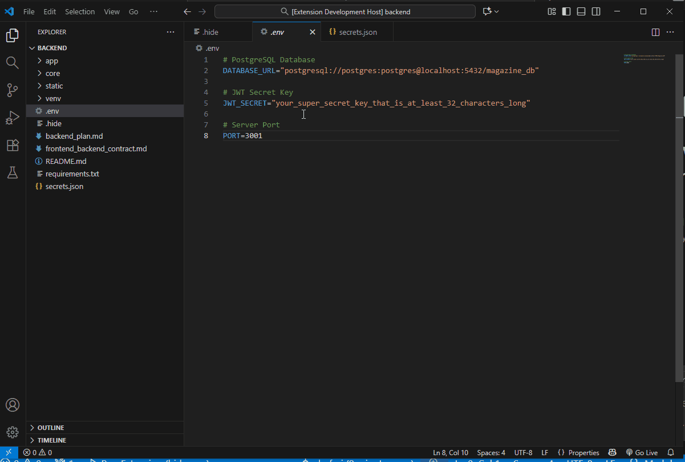

# Hide Env for Visual Studio Code

**Quickly and automatically hide sensitive information in your files. Perfect for screen sharing, live coding, and protecting your secrets.**

`Hide Env` is a Visual Studio Code extension designed to prevent accidental exposure of sensitive data, such as API keys, environment variables, and other secrets. It works by visually obscuring the values in your files that match predefined patterns, replacing them with `******`.

This is especially useful during screen sharing sessions, video recordings, or live-coding presentations, ensuring your confidential information remains private.

## Demo

*(A GIF is the best way to show what your extension does!)*



### How to Add Your Own GIF

1.  **Record a short GIF** of the extension in action. A great showcase would be:
    *   Showing a file with secrets (e.g., an `.env` file).
    *   Showing how the values are automatically hidden.
    *   Opening the `.hide` file and commenting out a rule.
    *   Showing the values reappear in the `.env` file.
2.  **Recommended tools** for screen recording to GIF:
    *   [LICEcap](https://www.cockos.com/licecap/) (Windows, macOS) - Simple and lightweight.
    *   [ScreenToGif](https://www.screentogif.com/) (Windows) - Powerful with a built-in editor.
    *   [Kap](https://getkap.co/) (macOS) - Modern and easy to use.
3.  **Save the GIF** as `demo.gif` inside an `images` folder in your project's root. The path in your repository should be `images/demo.gif`. The image link above should then work automatically.

## Features

- **Automatic Hiding:** Automatically hides sensitive values in files that match your rules.
- **`.gitignore`-Style Rules:** Uses a `.hide` file in your project root that follows familiar `.gitignore` syntax.
- **Flexible Separators:** Works with both `=` and`:` as key-value separators, making it compatible with `.env` files, JSON, YAML, and more.
- **Real-time Updates:** The extension reacts instantly to changes in your `.hide` file. Add or remove a rule, and see the effect immediately without reloading.
- **Simple and Lightweight:** No complex configuration. Just create a `.hide` file and you're ready to go.

## How to Use

1.  **Install:** Install the `Hide Env` extension from the VS Code Marketplace.
2.  **Create a `.hide` file:** In the root directory of your project, create a file named `.hide`.
3.  **Define Your Rules:** Add file patterns to the `.hide` file, just like you would with a `.gitignore` file.

    **Example `.hide` file:**
    ```
    # Hide the root .env file
    .env

    # Hide any file named secrets.json
    secrets.json

    # Hide all files ending with .prod.env in any subdirectory
    **/*.prod.env
    ```
4.  **See the Magic:** Open a file that matches one of your rules (e.g., `.env`) containing `API_KEY=YOUR_SECRET_VALUE`. The extension will automatically hide the value: `API_KEY=******`.

To temporarily see the real value, you can comment out the corresponding rule in your `.hide` file (by adding a `#` at the beginning of the line) and save the file. The value will reappear instantly.

## Extension Settings

This extension does not add any VS Code settings. Configuration is managed entirely through the `.hide` file.

## Release Notes

See the [CHANGELOG.md](CHANGELOG.md) for detailed information about every release.

## Contributing

This is an open-source project and contributions are welcome! Feel free to open an issue or submit a pull request once the repository is public.

## License

This project is licensed under the MIT License. See the [LICENSE](LICENSE) file for details.